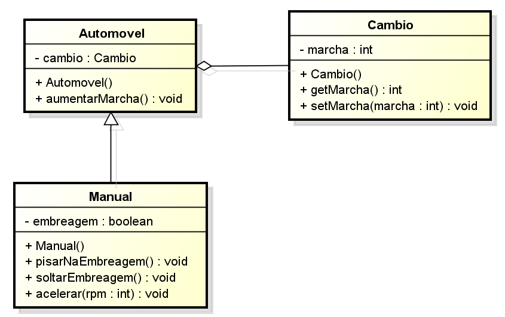
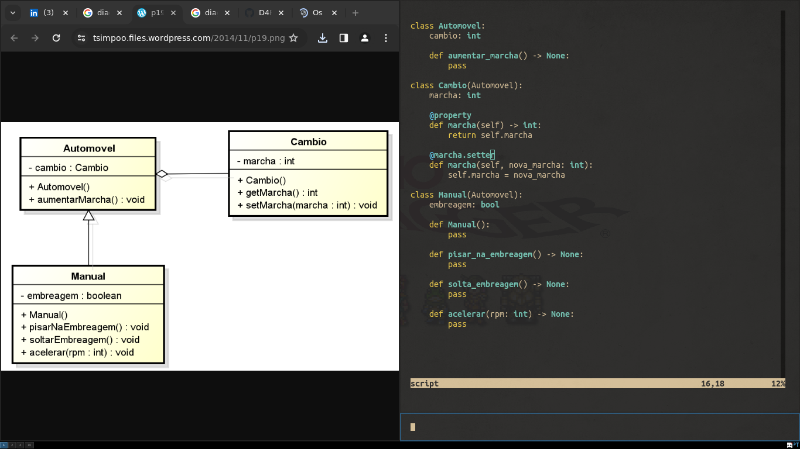

# Diagrama-de-classes-UML
Os símbolos de diagrama de classe UML pré-desenhados representam classe, classe de modelo, objeto, item, pacote, interface, dependência, composição e associação, etc. Esses símbolos ajudam a criar diagramas e documentação precisos. 

